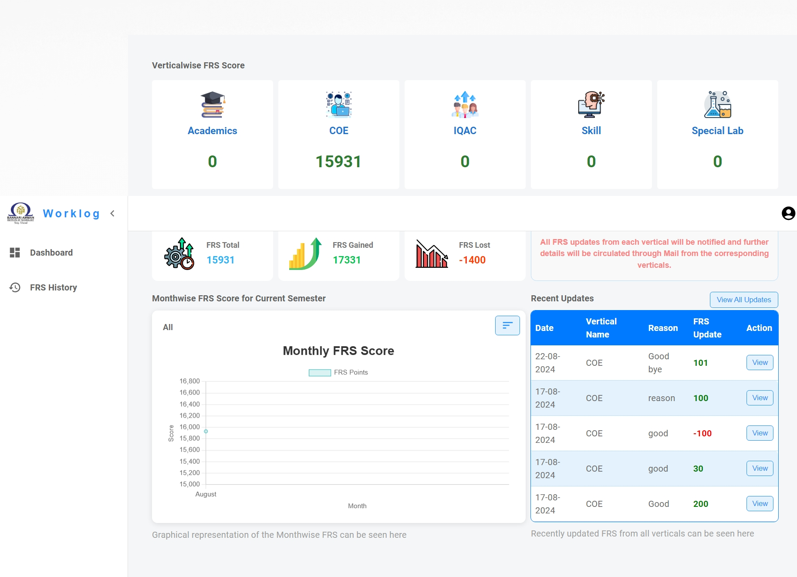
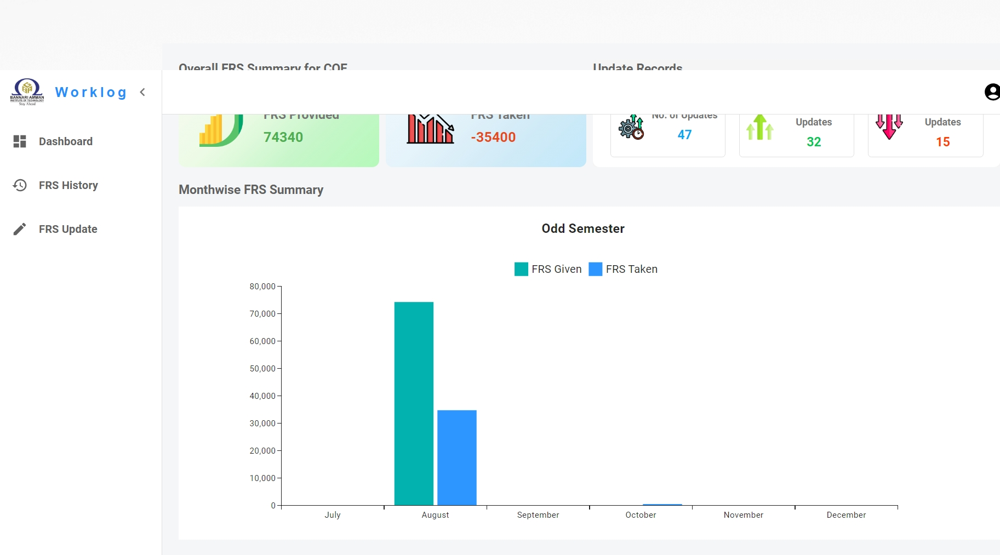
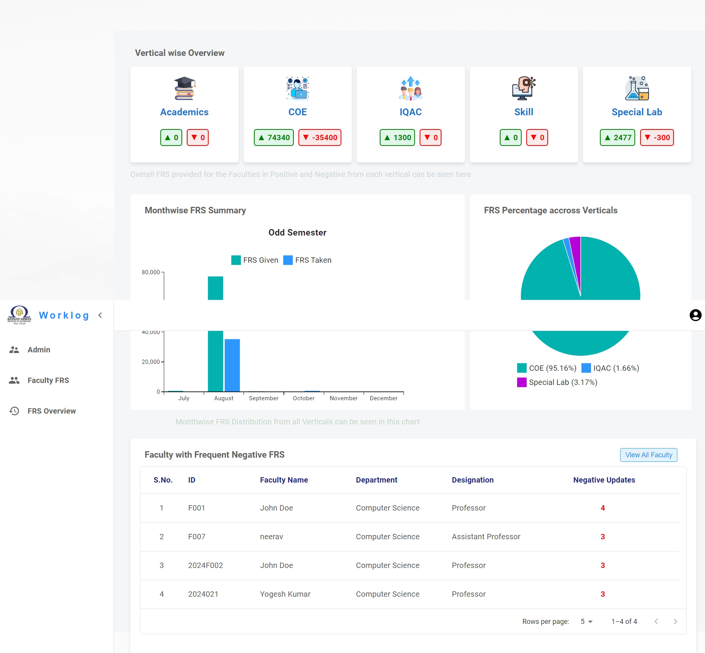
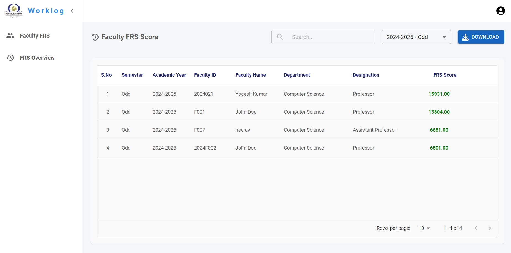
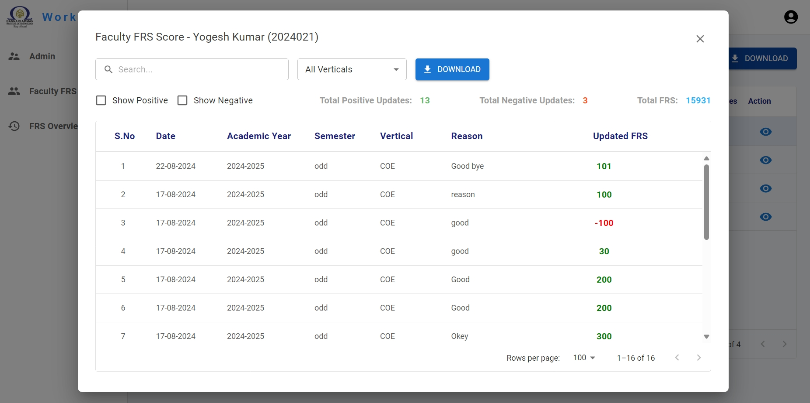

# 🎓 Faculty Ranking System

The **Faculty Ranking System** is a smart performance evaluation tool designed to assess and rank faculty members based on a calculated **FRS (Faculty Reliable Score)**. It provides role-specific dashboards and deep performance insights to help improve academic quality and efficiency.

> 📊 Performance-Based Scoring  
> 🔐 Role-Based Dashboards  
> ⚙️ Automated Faculty Ranking

---

## 📌 Table of Contents

- [🎯 Overview](#-overview)
- [👤 Roles and Dashboards](#-roles-and-dashboards)
- [🚀 Features](#-features)
- [⚙️ How It Works](#-how-it-works)
- [🖥️ Screenshots](#-screenshots)
- [🛠️ Installation](#-installation)
- [📬 Contact](#-contact)
- [📜 License](#-license)

---

## 🎯 Overview

Faculty Ranking is a system developed to manage and calculate rankings for faculty members based on their performance. The system generates an **FRS (Faculty Reliable Score)** using **positive and negative metrics**, which are then used to rank faculty members.

---

## 👤 Roles and Dashboards

The system supports three roles, each with a dedicated and tailored dashboard:

### 👨‍🏫 User (Individual Faculty)
- View personal **FRS score** and detailed metric breakdown.
- Monitor performance improvements and goals.



### 🧑‍💼 Vertical Head (Head of Department)
- View and manage performance of faculty within their department.
- Provide feedback, analyze departmental trends, and approve submissions.



### 🧑‍⚖️ Admin (Principal/Management)
- Full-system access including all scores and rankings.
- Manage user roles, set scoring criteria, approve final scores.



> Each user is redirected to their respective dashboard automatically upon login.



---

## 🚀 Features

- ✅ **Role-Based Access & Routing**
- ✅ **FRS Calculation Based on Dynamic Metrics**
- ✅ **Transparent Faculty Performance Evaluation**
- ✅ **Visual Performance Feedback and Comparison**
- ✅ **Admin Control Panel for Full Oversight**

---

## ⚙️ How It Works

The system uses an intelligent scoring algorithm:

### ➕ Positive Metrics:
- Academic contributions (research, publishing, etc.)
- Event participation (seminars, workshops)
- Leadership in university initiatives

### ➖ Negative Metrics:
- Incomplete tasks
- Poor reviews from peers/students
- Non-participation in institutional duties

### 🎯 Final FRS:
```text
FRS = Total Positive Score - Total Negative Score
```

This score helps rank faculty members fairly and transparently.



---

## 🖥️ Screenshots

- User Dashboard  
  

- Vertical Head Dashboard  
  

- Admin Dashboard  
  

- Dashboard Overview  
  

- FRS Popup  
  

---

## 🛠️ Installation

### 1️⃣ Clone the Repository

```bash
git clone https://github.com/Yogeshkumar200516/Faculty_Ranking.git  
cd Faculty_Ranking
```

### 2️⃣ Setup Frontend

```bash
cd Frontend
npm install
npm run dev
```

### 3️⃣ Setup Backend

```bash
cd Backend
npm install
npm run dev
```

> ⚠️ Ensure your database credentials are configured in a `.env` file in the backend directory.

---

## 📬 Contact

- 👨‍💻 Developer: **Yogesh Kumar S**
- 📧 Email: [yogeshkumar.s.radha@gmail.com](mailto:yogeshkumar.s.radha@gmail.com)
- 🔗 LinkedIn: [linkedin.com/in/yogeshkumar2005](https://www.linkedin.com/in/yogeshkumar2005/)
- 💻 GitHub: [github.com/Yogeshkumar200516](https://github.com/Yogeshkumar200516)

---

## 📜 License

**MIT License © 2025 Yogesh Kumar S**

Permission is hereby granted...

---

## ⭐ Support & Contribution

If this project helped you:

- ⭐ Star the repository
- 🧠 Share feedback and ideas
- 💬 Report bugs or suggestions via issues
- 🤝 Contribute via PRs

📈 Empowering institutions with intelligent faculty evaluation systems.


