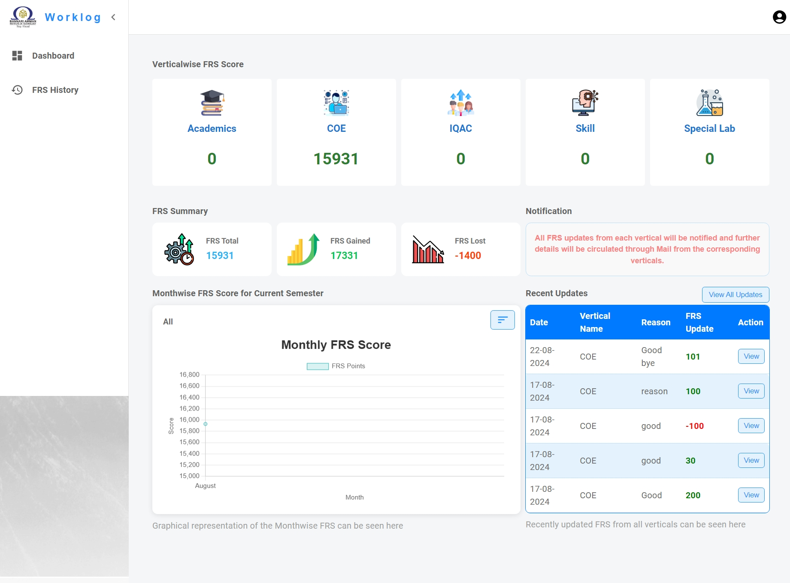
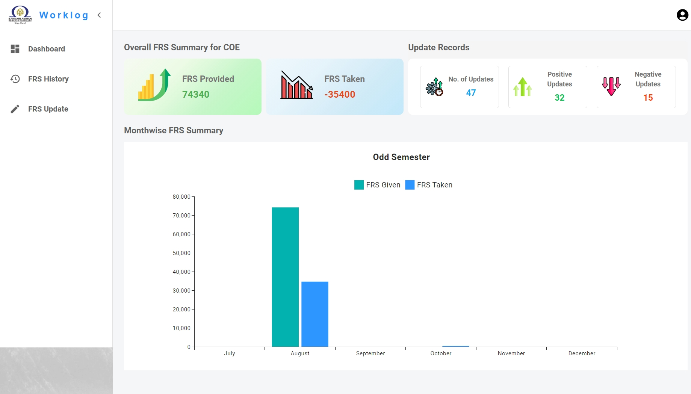
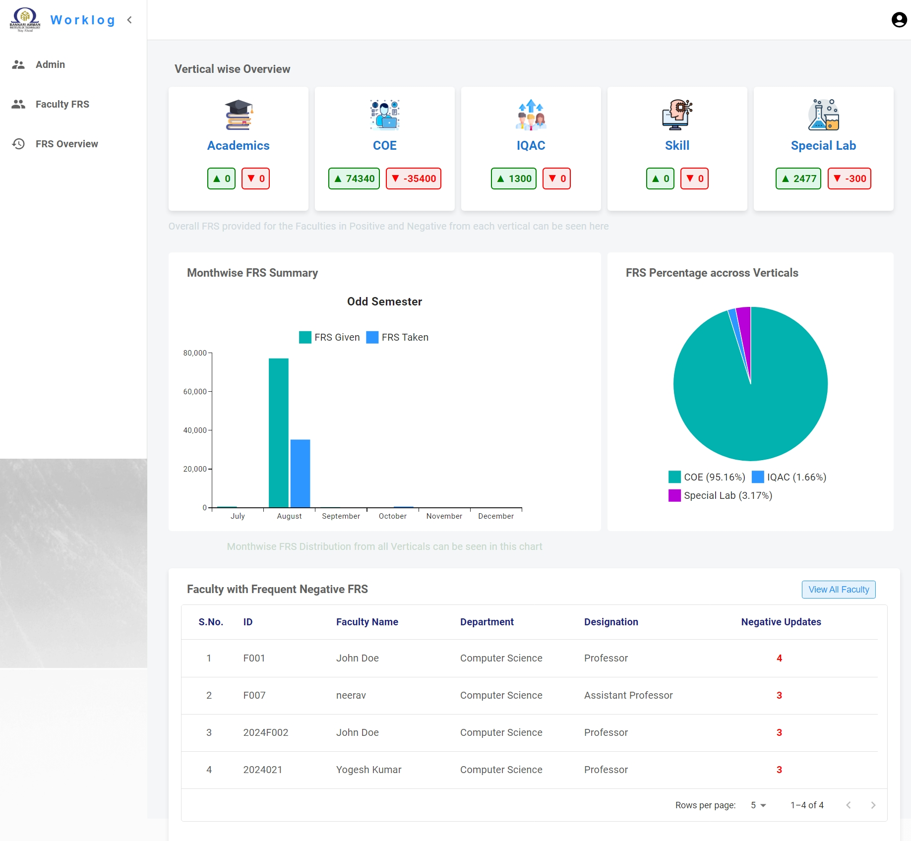

# Faculty Ranking

Faculty Ranking is a system developed to manage and calculate rankings for faculty members based on their performance. The system generates an FRS (Faculty Reliable Score) that evaluates faculty performance using positive and negative scores, which are used to calculate their overall ranking.

## Roles and Dashboards

The Faculty Ranking system includes role-based dashboards, ensuring that users are navigated to the appropriate interface based on their role within the institution:

### User (Individual Faculty):
- Access to personal performance data, including their FRS score.
- View detailed insights into positive and negative metrics contributing to their ranking.
- Ability to track progress and performance improvements.



### Vertical Head (Head of Department):
- Access to the performance data and rankings of all faculty members under their department.
- Manage and monitor faculty activities, provide feedback, and approve scores.
- Review and analyze departmental performance trends.



### Admin (Principal or Management Official):
- Full access to the entire system, including all faculty members' rankings and FRS scores.
- Ability to oversee performance across all departments, set evaluation criteria, and approve final scores.
- Manage users, roles, and performance thresholds across the institution.



Each role has a unique dashboard tailored to the specific needs and responsibilities of the user.


## Features

- **Role-Based Navigation:** Directs users to different dashboards based on their role (Faculty, Vertical Head, Admin).
- **Ranking System:** Provides an automated ranking of faculty members based on their performance.
- **FRS (Faculty Reliable Score):** Calculates a reliable score for each faculty based on both positive and negative performance indicators.
- **Performance Metrics:** Evaluates faculty performance across various criteria to generate a balanced and accurate score.

## How It Works

The Faculty Ranking system uses a structured algorithm to calculate the FRS. The score is divided into positive and negative components, each representing specific performance metrics of the faculty.

### Positive Metrics:
- Contributions to academic and non-academic activities.
- Participation in conferences, workshops, and seminars.
- Leadership in special projects or institutional roles.

### Negative Metrics:
- Lack of participation in key activities.
- Poor performance in assigned duties or responsibilities.
- Negative feedback from students or peers.

The final FRS is derived by subtracting the negative score from the positive score, resulting in an overall performance score that is used to determine the ranking.


## Installation

To get started with the Faculty Ranking project, follow these steps:

### Clone the repository:

```bash
git clone https://github.com/Yogeshkumar200516/Faculty_Ranking.git

